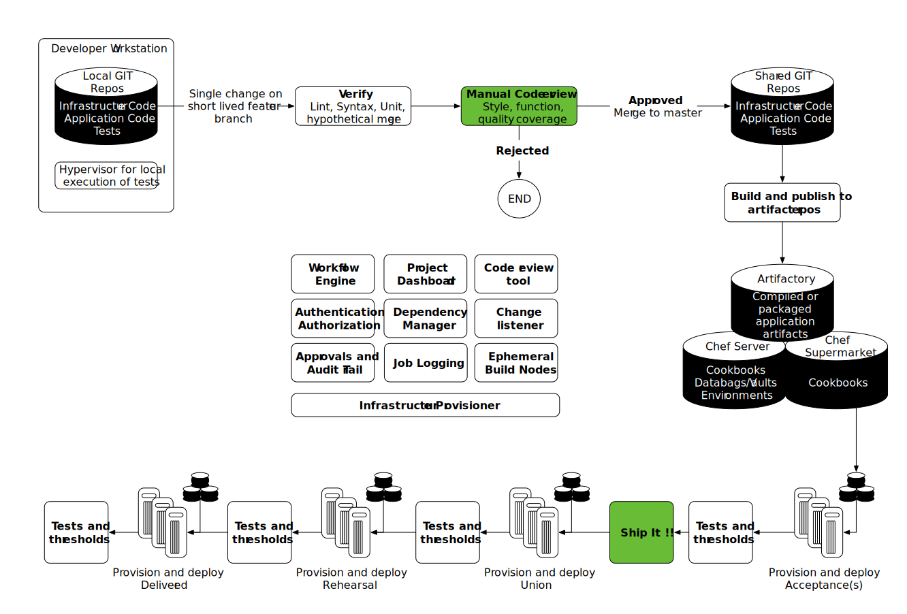

# Continuous Delivery

Continuous Delivery can be considered an extension of the practice of continuous integration. It's normally an automated process to help with deploying changes at high velocity.

## Continuous integration

The process of continuous integration is used to ensure that we always have code which is releasable. As we develop features and bug fixes, we write unit tests that prove individual components work, but we also write functional tests that prove seperately developed components work together.

When we detect a change has been committed to version control, we:-

* **Verify** the change with the following steps
  * Build/Compile the code and tests
  * Run the unit tests
  * Run the lint checker (complexity, style, maintainability)

* **Code Review** to ensure we developed the right thing in the right way

* We **merge the change to master** (hopefully with no merge conflicts)

* We **build** and **publish** to our binary **artifact** repository

* We publish our components to **acceptance** where our stakeholder can see them.

* Product owner hits "ship it" to ship the changes queued in acceptance when ready

* Change is deployed and tested in integration, pre-prod and production in turn (unless tests fail).

## Flow Diagram

## Components

* A [version control system](Version Control.md) to receive our changes
* A **workflow engine**

TODO: Describe the rest of the components
